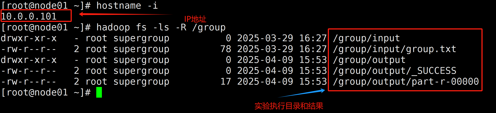
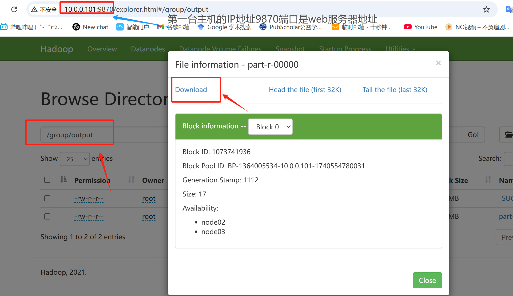

# bigdata

1、首先 resources 文件夹里面的四个xml配置文件需要换成自己环境的配置文件。使用 rz 命令在hadoop安装目录下etc/hadoop里面可以找到自己的配置文件。

2、实验除了wordcount之外的三个需要修改hdfs的文件路径即可，另外你的文件输出路径一定不能先创建不然会报错。

3、实验报告实验结果提交格式。

```
hostname -i
```

使用上述命令显示自己主机的ip

每一个实验执行完之后使用hdfs文件系统来显示结果，例如：分组实验中，你的数据在hdfs文件系统的  /group/input/group.txt，你的结果输出在/group/output/。那么在执行完之后需要使用下面命令递归查看，之后跟你的ip地址一起截图。如下图所示。**这里的IP地址和你的实验执行结果要在一起截图，不能截图2张。其他实验也是一样的提交方法，都要带上你自己的IP地址。**

```
hadoop fs -ls -R /group
```



最后将你的实验结果打开，实验执行完结果就是**part-r-00000**这个文件可以用以下命令下载，然后vim打开。

```
hadoop fs -get /group/output/part-r-00000
```

也可以在你的web文件系统直接下载用记事本打开。例如：




打开结果，截图。**一个实验总共2张图一个IP和运行结果图片，一个结果图片。**
